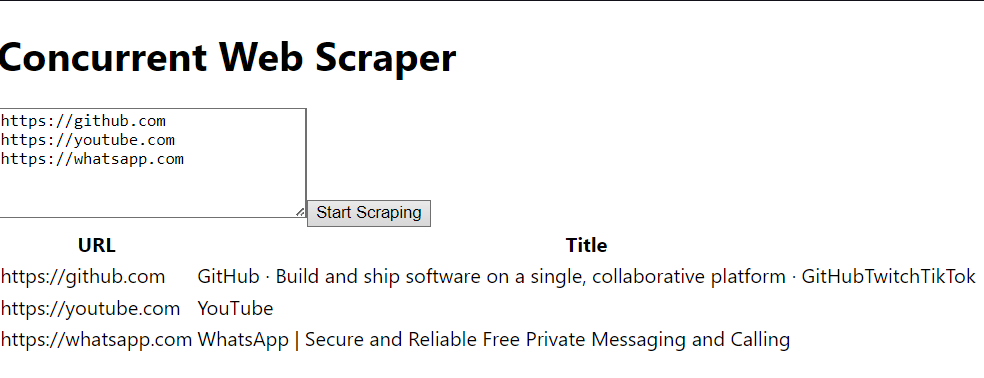

# WebScraper
## Install project
```shell
git clone https://github.com/enndylove/WebScraber.git
```
```shell
cd WebScraber
```

## Run sever(backend)
```shell
cd concurrent-web-scraper-server
```

### Install packages
```shell
npm install
```
### run server in localhost:3000
```shell
npm start
```

## Run client part in second terminal
```shell
cd concurrent-web-scraper-frontend
```
### Install packages
```shell
npm install
```
### run server in localhost:3001
```shell
npm start
```


# DONE!)

## Website screenshot:


## Request example:
```json
{
  "urls": ["https://github.com", "https://youtube.com", "https://whatsapp.com"]
}
```
## Response: 
```json
// if timeout req > 5 sec. the request is not processed further
[
    {
        "url": "https://github.com",
        "title": "GitHub · Build and ship software on a single, collaborative platform · GitHubTwitchTikTok"
    },
    {
        "url": "https://youtube.com",
        "title": "YouTube"
    },
    {
        "url": "https://whatsapp.com",
        "error": "timeout of 5000ms exceeded"
    }
]
```

## Main code: 
#### `/concurrent-web-scraper-server/src/scraper/scraper.service.ts`
```typescript
import { Injectable } from '@nestjs/common';
import axios from 'axios';
import * as cheerio from 'cheerio';

@Injectable()
export class ScraperService {
    async scrapeUrls(urls: string[]): Promise<any[]> {
        return Promise.all(
            urls.map(async (url) => {
                try {
                    const { data } = await axios.get(url, { timeout: 5000 });
                    const $ = cheerio.load(data);
                    // for example, take the page title
                    const title = $('title').text();
                    return { url, title };
                } catch (error) {
                    return { url, error: error.message };
                }
            }),
        );
    }
}
```
#### Use scrape functionality in client part example: 
```js
try {
    const { data } = await axios.post('http://localhost:3000/scraper', {
        urls: urls.split('\n').map((url) => url.trim()),
    });
    return data
} catch (error) {
    console.error('Error scraping:', error);
}
```